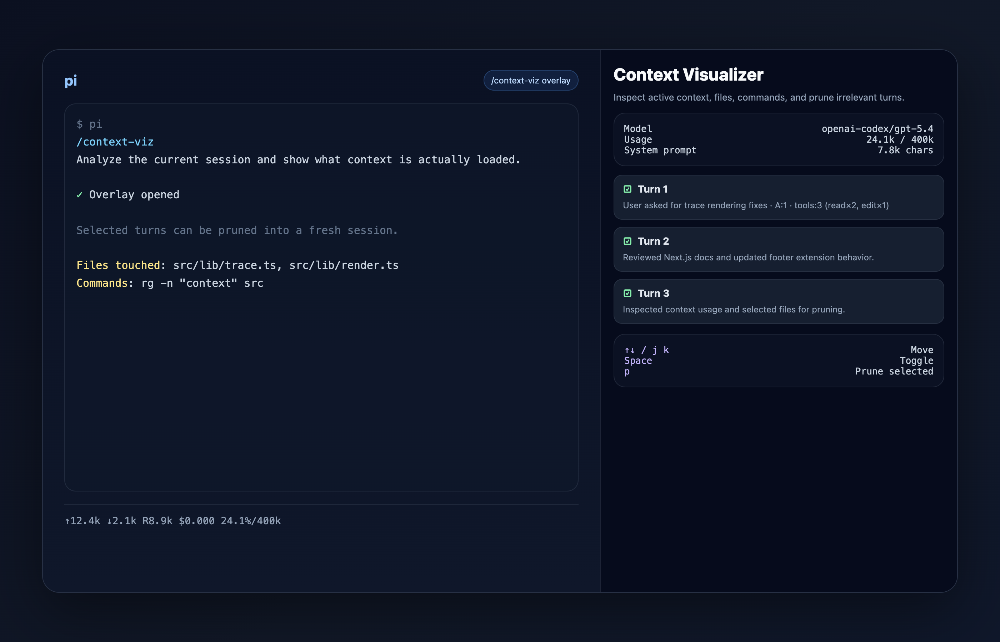

# pi-context-viz

Context visualizer extension for [pi coding agent](https://github.com/earendil-works/pi-mono).



## Features

- `/context-viz` right-side overlay
- Shows current model and context usage
- Shows system prompt size
- Groups context by user turn
- Summarizes each answer by assistant/tool counts
- Tracks files touched by tool calls
- Checkbox UI for selecting turns/files
- Creates a new pruned session with only selected turns

## Install

```bash
pi install git:git@github.com:Yukariko/context-viz.git
```

Or run temporarily:

```bash
pi -e git:git@github.com:Yukariko/context-viz.git
```

## Usage

In pi:

```text
/context-viz
```

Keys:

```text
↑↓ / j k    Move cursor
Space       Toggle selected turn/file
p           Prune selected turns into a new session
q / Esc     Close overlay
```

## Pruning behavior

Pruning does **not** rewrite or damage the original session. Instead, it creates a new pi session and copies only the selected turns into it.

Selection rules:

- Selecting a turn automatically includes files used by that turn.
- Deselecting a turn removes files that are no longer used by selected turns.
- Selecting a file automatically selects turns that used that file.
- Deselecting a file deselects turns that used that file.

## Development

This is a pi package. The extension entry is:

```text
extensions/context-viz.ts
```

After editing:

```bash
git add .
git commit -m "Update context visualizer"
git push
pi update git:git@github.com:Yukariko/context-viz.git
```
